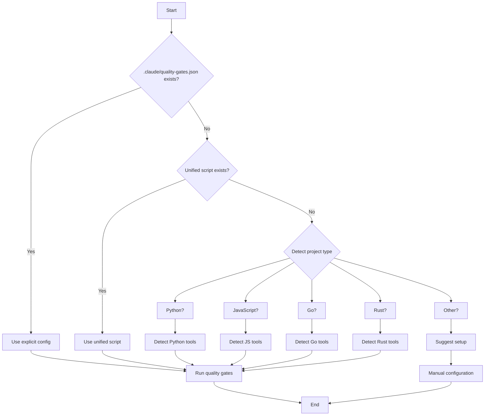

# Quality Gate Detection Rules

Comprehensive rules for detecting project types and their quality gate tools.

## Detection Priority

1. **Explicit configuration** (highest priority)
   - `.claude/quality-gates.json`
   - `CLAUDE.md` Definition of Done section

2. **Unified scripts**
   - `./scripts/check_all.sh`
   - `npm run check` (package.json)
   - `make check` (Makefile)

3. **Project type detection** (fallback)
   - Detect language/framework
   - Detect installed tools
   - Provide default configuration

## Detection Algorithm



## Python Project Detection

### Detection Criteria

**Project type indicators:**
1. `pyproject.toml` exists
2. `requirements.txt` exists
3. `setup.py` exists
4. `src/` directory contains `.py` files

**Confidence:**
- High: `pyproject.toml` with `[tool.*]` sections
- Medium: `requirements.txt` with Python packages
- Low: `setup.py` only

### Tool Detection

#### Type Checker

**Priority order:**
1. `uv run pyright` (if uv available and pyright configured)
2. `pyright` (if pyright globally installed)
3. `mypy src/` (if mypy available)
4. None (recommend pyright installation)

**Detection:**
```bash
# Check for pyright with uv
if command -v uv >/dev/null 2>&1 && \
   uv run pyright --version >/dev/null 2>&1; then
    TYPE_CHECKER="uv run pyright"
fi
```

**Configuration files:**
- `pyproject.toml` section `[tool.pyright]`
- `pyrightconfig.json`

#### Linter

**Priority order:**
1. `uv run ruff check` (if ruff available)
2. `ruff check` (if ruff globally installed)
3. `pylint src/` (if pylint available)
4. `flake8 src/` (if flake8 available)

**Detection:**
```bash
# Check for ruff with uv
if command -v uv >/dev/null 2>&1 && \
   uv run ruff --version >/dev/null 2>&1; then
    LINTER="uv run ruff check src/ tests/"
fi
```

**Configuration files:**
- `pyproject.toml` section `[tool.ruff]`
- `ruff.toml`
- `.pylintrc`
- `.flake8`

#### Dead Code Detector

**Priority order:**
1. `uv run vulture` (if vulture available)
2. `vulture` (if vulture globally installed)
3. None (optional tool)

**Detection:**
```bash
# Check for vulture with uv
if command -v uv >/dev/null 2>&1 && \
   uv run vulture --version >/dev/null 2>&1; then
    DEAD_CODE="uv run vulture src/ --min-confidence 80"
fi
```

**Configuration files:**
- `pyproject.toml` section `[tool.vulture]`
- `vulture.txt` (whitelist)

#### Test Runner

**Priority order:**
1. `uv run pytest` (if pytest available)
2. `pytest` (if pytest globally installed)
3. `python -m unittest discover` (built-in, always available)

**Detection:**
```bash
# Check for pytest with uv
if command -v uv >/dev/null 2>&1 && \
   uv run pytest --version >/dev/null 2>&1; then
    TESTS="uv run pytest tests/ -q"
fi
```

**Configuration files:**
- `pyproject.toml` section `[tool.pytest.ini_options]`
- `pytest.ini`
- `setup.cfg` section `[tool:pytest]`

#### Formatter

**Priority order:**
1. `uv run ruff format` (if ruff available)
2. `black` (if black available)
3. None (optional)

**Detection:**
```bash
# Check for ruff format with uv
if command -v uv >/dev/null 2>&1 && \
   uv run ruff --version >/dev/null 2>&1; then
    FORMATTER="uv run ruff format --check src/ tests/"
fi
```

**Configuration files:**
- `pyproject.toml` section `[tool.ruff.format]`
- `pyproject.toml` section `[tool.black]`

---

## JavaScript/TypeScript Project Detection

### Detection Criteria

**Project type indicators:**
1. `package.json` exists
2. `node_modules/` directory exists
3. `src/` directory contains `.js`, `.ts`, `.jsx`, `.tsx` files

**TypeScript project:**
1. `tsconfig.json` exists
2. `package.json` has `typescript` in dependencies

**Confidence:**
- High: `package.json` with scripts and dependencies
- Medium: `package.json` with minimal config
- Low: Only `node_modules/` exists

### Tool Detection

#### Type Checker (TypeScript only)

**Detection:**
```bash
# Check if TypeScript project
if [[ -f tsconfig.json ]]; then
    TYPE_CHECKER="npx tsc --noEmit"
fi
```

**Configuration files:**
- `tsconfig.json`

#### Linter

**Priority order:**
1. `npx eslint` (if .eslintrc.* exists or eslint in package.json)
2. `npx @biomejs/biome check` (if biome.json exists)
3. None (recommend eslint)

**Detection:**
```bash
# Check for ESLint config
if [[ -f .eslintrc.js ]] || [[ -f .eslintrc.json ]] || \
   grep -q '"eslint"' package.json 2>/dev/null; then
    LINTER="npx eslint src/"
fi
```

**Configuration files:**
- `.eslintrc.js`
- `.eslintrc.json`
- `package.json` section `eslintConfig`
- `biome.json`

#### Test Runner

**Priority order:**
1. `npm test` (if "test" script in package.json)
2. `npx jest` (if jest.config.js exists or jest in package.json)
3. `npx vitest run` (if vitest.config.ts exists or vitest in package.json)
4. `npx mocha` (if .mocharc.js exists or mocha in package.json)

**Detection:**
```bash
# Check for test script in package.json
if grep -q '"test"' package.json 2>/dev/null; then
    TESTS="npm test"
fi
```

**Configuration files:**
- `jest.config.js`
- `vitest.config.ts`
- `.mocharc.js`
- `package.json` section `jest`

#### Formatter

**Priority order:**
1. `npx prettier --check` (if .prettierrc.* exists or prettier in package.json)
2. `npx @biomejs/biome format` (if biome.json exists)
3. None (optional)

**Detection:**
```bash
# Check for Prettier config
if [[ -f .prettierrc.js ]] || [[ -f .prettierrc.json ]] || \
   grep -q '"prettier"' package.json 2>/dev/null; then
    FORMATTER="npx prettier --check src/"
fi
```

**Configuration files:**
- `.prettierrc.js`
- `.prettierrc.json`
- `package.json` section `prettier`

---

## Go Project Detection

### Detection Criteria

**Project type indicators:**
1. `go.mod` exists
2. `go.sum` exists
3. Directory contains `.go` files

**Confidence:**
- High: `go.mod` exists
- Medium: Multiple `.go` files
- Low: Single `.go` file

### Tool Detection

#### Type Checker (Build)

**Detection:**
```bash
# Go build compiles and type-checks
if command -v go >/dev/null 2>&1; then
    TYPE_CHECKER="go build ./..."
fi
```

**Configuration:**
- No explicit config file (uses go.mod)

#### Linter

**Priority order:**
1. `golangci-lint run` (if golangci-lint installed)
2. `staticcheck ./...` (if staticcheck installed)
3. `go vet ./...` (built-in, always available)

**Detection:**
```bash
# Check for golangci-lint
if command -v golangci-lint >/dev/null 2>&1; then
    LINTER="golangci-lint run"
fi
```

**Configuration files:**
- `.golangci.yml`
- `.golangci.json`

#### Test Runner

**Detection:**
```bash
# Go test is built-in
if command -v go >/dev/null 2>&1; then
    TESTS="go test ./... -v"
fi
```

**Configuration:**
- No explicit config file

#### Formatter

**Detection:**
```bash
# Go fmt is built-in
if command -v go >/dev/null 2>&1; then
    FORMATTER="test -z \"\$(gofmt -l .)\""
fi
```

**Alternative:**
```bash
# Use goimports for formatting + import management
if command -v goimports >/dev/null 2>&1; then
    FORMATTER="test -z \"\$(goimports -l .)\""
fi
```

**Configuration:**
- No explicit config file (Go has opinionated formatting)

---

## Rust Project Detection

### Detection Criteria

**Project type indicators:**
1. `Cargo.toml` exists
2. `Cargo.lock` exists
3. `src/` directory contains `.rs` files

**Confidence:**
- High: `Cargo.toml` with `[package]` section
- Medium: `Cargo.toml` exists
- Low: Only `.rs` files

### Tool Detection

#### Type Checker (Check)

**Detection:**
```bash
# Cargo check is fast type checking without building
if command -v cargo >/dev/null 2>&1; then
    TYPE_CHECKER="cargo check"
fi
```

**Configuration:**
- `Cargo.toml`

#### Linter

**Detection:**
```bash
# Clippy is official Rust linter
if command -v cargo >/dev/null 2>&1; then
    LINTER="cargo clippy -- -D warnings"
fi
```

**Configuration files:**
- `clippy.toml`
- `.clippy.toml`

#### Test Runner

**Detection:**
```bash
# Cargo test is built-in
if command -v cargo >/dev/null 2>&1; then
    TESTS="cargo test"
fi
```

**Configuration:**
- `Cargo.toml` section `[profile.test]`

#### Formatter

**Detection:**
```bash
# Rustfmt is built-in
if command -v cargo >/dev/null 2>&1; then
    FORMATTER="cargo fmt --check"
fi
```

**Configuration files:**
- `rustfmt.toml`
- `.rustfmt.toml`

---

## Ruby Project Detection

### Detection Criteria

**Project type indicators:**
1. `Gemfile` exists
2. `Gemfile.lock` exists
3. `.rb` files exist

**Confidence:**
- High: `Gemfile` with dependencies
- Medium: `Gemfile` exists
- Low: Only `.rb` files

### Tool Detection

#### Type Checker

**Priority order:**
1. `bundle exec srb tc` (if sorbet in Gemfile)
2. `bundle exec steep check` (if steep in Gemfile)
3. None (Ruby is dynamically typed)

**Detection:**
```bash
# Check for Sorbet
if grep -q "sorbet" Gemfile 2>/dev/null; then
    TYPE_CHECKER="bundle exec srb tc"
fi
```

**Configuration files:**
- `sorbet/config`
- `Steepfile`

#### Linter

**Detection:**
```bash
# Check for RuboCop
if grep -q "rubocop" Gemfile 2>/dev/null; then
    LINTER="bundle exec rubocop"
fi
```

**Configuration files:**
- `.rubocop.yml`

#### Test Runner

**Priority order:**
1. `bundle exec rspec` (if spec/ directory exists)
2. `bundle exec rake test` (if test/ directory exists)

**Detection:**
```bash
# Check for RSpec
if [[ -d spec ]]; then
    TESTS="bundle exec rspec"
fi
```

**Configuration files:**
- `.rspec`
- `spec/spec_helper.rb`

---

## Java Project Detection

### Detection Criteria

**Project type indicators:**
1. `pom.xml` exists (Maven)
2. `build.gradle` exists (Gradle)
3. `.java` files exist

**Confidence:**
- High: `pom.xml` or `build.gradle` with dependencies
- Medium: Build file exists
- Low: Only `.java` files

### Tool Detection (Maven)

#### Type Checker (Compile)

**Detection:**
```bash
if [[ -f pom.xml ]]; then
    TYPE_CHECKER="mvn compile"
fi
```

#### Linter

**Priority order:**
1. `mvn checkstyle:check` (if checkstyle plugin configured)
2. `mvn pmd:check` (if PMD plugin configured)

**Detection:**
```bash
# Check for Checkstyle in pom.xml
if grep -q "checkstyle" pom.xml 2>/dev/null; then
    LINTER="mvn checkstyle:check"
fi
```

**Configuration files:**
- `checkstyle.xml`
- `pmd.xml`

#### Test Runner

**Detection:**
```bash
if [[ -f pom.xml ]]; then
    TESTS="mvn test"
fi
```

### Tool Detection (Gradle)

#### Type Checker (Build)

**Detection:**
```bash
if [[ -f build.gradle ]]; then
    TYPE_CHECKER="./gradlew build"
fi
```

#### Linter

**Detection:**
```bash
# Check for Checkstyle in build.gradle
if grep -q "checkstyle" build.gradle 2>/dev/null; then
    LINTER="./gradlew checkstyleMain"
fi
```

#### Test Runner

**Detection:**
```bash
if [[ -f build.gradle ]]; then
    TESTS="./gradlew test"
fi
```

---

## Multi-Language Project Detection

### Detection Strategy

1. **Detect all present languages**
   - Scan for language-specific files
   - Build language list

2. **Check for monorepo structure**
   - Look for `packages/`, `apps/`, `services/` directories
   - Detect per-directory language configs

3. **Find unified script**
   - `./scripts/check_all.sh` (runs all language checks)
   - Individual scripts per language

4. **Provide language-specific runners**
   - Backend checks: `./scripts/check_backend.sh`
   - Frontend checks: `./scripts/check_frontend.sh`

### Example: Python + TypeScript Monorepo

```bash
# Detect structure
monorepo/
├── backend/          # Python
│   ├── pyproject.toml
│   └── src/
├── frontend/         # TypeScript
│   ├── package.json
│   └── src/
└── scripts/
    ├── check_all.sh      # Runs both
    ├── check_backend.sh  # Python only
    └── check_frontend.sh # TypeScript only
```

**Detection:**
```bash
# Check if monorepo
if [[ -d backend ]] && [[ -d frontend ]]; then
    # Monorepo detected
    if [[ -f scripts/check_all.sh ]]; then
        RUNNER="./scripts/check_all.sh"
    else
        # Create unified runner
        RUNNER="./scripts/check_backend.sh && ./scripts/check_frontend.sh"
    fi
fi
```

---

## Explicit Configuration

### .claude/quality-gates.json

**Purpose:** Override auto-detection with explicit configuration.

**Example:**
```json
{
  "runner": "./scripts/check_all.sh",
  "tools": {
    "type_checker": "uv run pyright",
    "linter": "uv run ruff check src/ tests/",
    "dead_code": "uv run vulture src/ --min-confidence 80",
    "tests": "uv run pytest tests/ -q",
    "formatter": "uv run ruff format --check src/ tests/"
  },
  "required": ["type_checker", "linter", "tests"],
  "optional": ["dead_code", "formatter"],
  "project_type": "python"
}
```

**Fields:**
- `runner`: Unified script to run (if exists)
- `tools`: Individual tools by category
- `required`: Tools that must pass
- `optional`: Tools that are nice-to-have
- `project_type`: Explicit project type

### CLAUDE.md Definition of Done

**Purpose:** Document quality gates for humans and Claude.

**Example:**
```markdown
## Quality Gates (MANDATORY)

Run before saying "done":

```bash
./scripts/check_all.sh  # Runs all checks in parallel
```

Individual checks if needed:
```bash
uv run pyright          # Type checking
uv run vulture src/     # Dead code detection
uv run pytest tests/    # Test suite
uv run ruff check src/  # Linting
```

**Non-negotiable:** Task is NOT done if quality gates fail. Fix or explain why.
```

**Detection:**
```bash
# Parse CLAUDE.md for quality gates
if grep -A 10 "## Quality Gates" CLAUDE.md | grep -q "check_all.sh"; then
    RUNNER="./scripts/check_all.sh"
fi
```

---

## Fallback Strategy

### No Quality Gates Detected

**Response:**
1. Inform user no quality gates found
2. Detect project type
3. Suggest standard tools for that project type
4. Offer to create `check_all.sh` script

**Example:**
```
⚠️ No quality gates detected

Project type: Python (detected via pyproject.toml)

Recommended tools:
- Type checking: pyright
- Linting: ruff
- Dead code: vulture
- Tests: pytest
- Formatting: ruff format

Would you like me to:
1. Install these tools: uv pip install pyright ruff vulture pytest
2. Create ./scripts/check_all.sh
3. Configure pyproject.toml

Select option (1/2/3 or 'all'):
```

### Partial Detection

**Response:**
1. Report what was detected
2. Suggest missing tools
3. Offer to configure

**Example:**
```
⚠️ Partial quality gate coverage

Detected:
✅ Type checking: pyright
✅ Tests: pytest
❌ Linting: Not configured
❌ Formatting: Not configured

Recommendations:
- Install ruff: uv pip install ruff
- Add [tool.ruff] to pyproject.toml
- Create ./scripts/check_all.sh

Would you like me to configure missing tools?
```

---

## Detection Summary

| Project Type | Primary Indicator | Type Checker | Linter | Tests |
|--------------|------------------|--------------|--------|-------|
| Python | pyproject.toml | pyright | ruff | pytest |
| JavaScript | package.json | (none) | eslint | jest |
| TypeScript | tsconfig.json | tsc | eslint | jest |
| Go | go.mod | go build | golangci-lint | go test |
| Rust | Cargo.toml | cargo check | clippy | cargo test |
| Ruby | Gemfile | sorbet | rubocop | rspec |
| Java (Maven) | pom.xml | mvn compile | checkstyle | mvn test |
| Java (Gradle) | build.gradle | gradle build | checkstyle | gradle test |

## Priority Rules

1. **Explicit config > Unified script > Auto-detection**
2. **Project-maintained tools > Global tools**
3. **Package manager runners (uv, npm) > Direct binary calls**
4. **Required tools (type, lint, test) > Optional tools (format, dead code)**
5. **Fast tools (ruff) > Slow tools (pylint) when equivalent**

